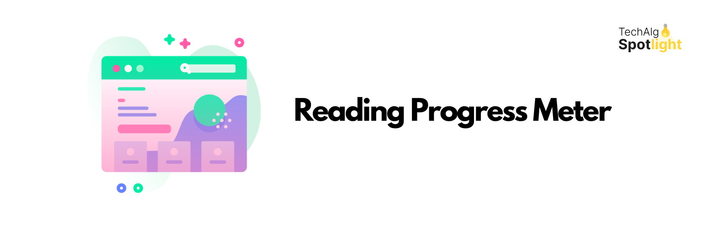

# Reading Progress Meter

**A customizable progress bar plugin that tracks reading progress on your pages and posts.**

## Description

Welcome to the Reading Progress Meter, your new best friend for tracking your reading progress! This nifty plugin helps you keep tabs on how much of your content your readers have devoured. Show it off in style at the top or bottom in pages and posts. It’s like having a reading buddy that never interrupts!

### Features

- **Progress bar height:** Adjustable to fit your aesthetic needs.
- **Foreground color:** Pick a color that screams, “I’m reading progress!”
- **Background color:** Choose a backdrop that makes the progress pop!
- **Position:** Stick it at the top or bottom.
- **Page Templates & Post Types:** Tailor it to different templates or post types – because who doesn’t love options?

## Installation

1. Download the plugin.
2. Upload the `reading-progress-meter` folder to your `wp-content/plugins` directory.
3. Activate the plugin through the 'Plugins' menu in WordPress.
4. Navigate to Tools > Reading Progress Meter to customize your progress bar to perfection.

## Frequently Asked Questions

**Q: Does it work on WordPress network/multisite?**  
A: Not yet! But keep your eyes peeled for version 2.0, where we’ll be fixing this. Want to help? Feel free to reach out or drop a coffee donation if you’re feeling generous!

## Screenshots

1. The plugin options page – where the magic happens.
2. Reading Progress Meter in action at a custom position on the Twenty Seventeen Theme.

## Changelog

**1.0**  
* Plugin initial release. Works fine and dandy! 🎉

## Credits

- **[TechAlgoSpotlight](https://techalgospotlight.com):** Your go-to source for tech insights and tips!

## Donate

If you find this plugin useful, consider buying me a coffee: [Donate](https://www.buymeacoffee.com/krunalkanojiya)

## License

This plugin is licensed under the [GPLv2](http://www.gnu.org/licenses/gpl-2.0.html) license.
